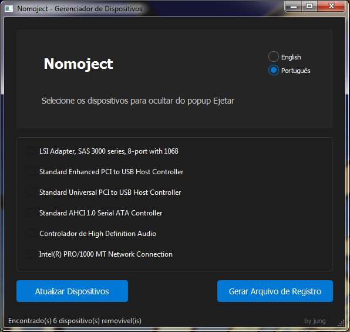

# Nomoject

[en-US](README.md) | pt-BR

Nomoject (No More Eject!) é uma aplicação Windows projetada para gerenciar dispositivos hotplug em máquinas virtuais QEMU. Permite aos usuários identificar e modificar as capacidades de dispositivos PCI removíveis através de modificações no registro do Windows.



## Funcionalidades

- Lista todos os dispositivos PCI com capacidade de remoção
- Seleção fácil de dispositivos com checkboxes
- Gera arquivos de registro para tornar dispositivos não-removíveis
- Interface moderna com tema escuro
- Compatível com Windows 7/Server 2008 e mais recentes
- Suporte multi-idioma

## Casos de Uso

- Prevenir remoção acidental de dispositivos em VMs QEMU
- Corrigir "Remover Hardware com Segurança" mostrando dispositivos virtuais
- Gerenciar dispositivos PCI passthrough em máquinas virtuais
- Modificação em lote de múltiplos dispositivos

## Instalação

### Via Release (Recomendado)
1. Baixe a última versão da página de [Releases](https://github.com/junglivre/Nomoject/releases/latest)
2. Extraia o arquivo ZIP
3. Execute o `Nomoject.exe`

### Via Código Fonte
1. Instale Python 3.7 ou mais recente
2. Instale as dependências necessárias:
   ```
   pip install -r requirements.txt
   ```
3. Execute a aplicação:
   ```
   python nomoject.py
   ```

## Compilando a partir do Código Fonte

Para criar um executável standalone:

1. Instale as dependências de build:
   ```
   pip install -r requirements.txt
   ```

2. Execute o script de build:
   ```
   python build.py
   ```

O executável será gerado na pasta `dist`.

## Como Funciona

O Nomoject analisa o Registro do Windows em `HKEY_LOCAL_MACHINE\SYSTEM\CurrentControlSet\Enum\PCI` procurando por dispositivos com valor `Capabilities` igual a 6 (removível). Ao gerar o arquivo de registro, ele altera este valor para 2 (não-removível) para os dispositivos selecionados.

## Considerações de Segurança

- A aplicação requer acesso ao registro para funcionar
- Arquivos .reg gerados modificam configurações do sistema
- Execute como administrador ao aplicar alterações no registro
- Sempre revise o arquivo .reg gerado antes de aplicá-lo

## Contribuindo

Contribuições são bem-vindas! Sinta-se à vontade para enviar um Pull Request.

## Licença

Este projeto está licenciado sob a Licença MIT - veja o arquivo [LICENSE](LICENSE) para detalhes.

## Agradecimentos

- Comunidade QEMU/KVM
- Desenvolvedores PyQt
- Todos os contribuidores e usuários

## Suporte

Se você encontrar problemas ou tiver dúvidas:
- Abra uma issue no GitHub
- Verifique issues existentes para soluções
- Revise a documentação 